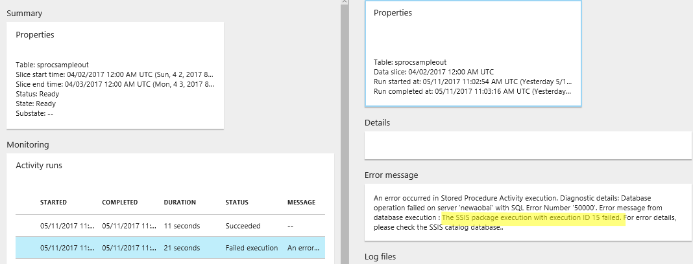

This sample shows how to use Stored Procedure Activity in ADF to launch execution of an SSIS package and return result. 

To use the sample:
1. Create the stored procedure using the sample USP_ExecuteSSISPackage.sql file. 
2. Create new ADF using the JSON definitions in the sample. This sample calls On-Premise SQL Server, so you will need to install and setup Data Management Gateway before setting up Linked Service, Dataset and Pipeline. 
3. Update following parameters to point to your deployed SSIS package

                    "storedProcedureParameters": {
                        "package_name": "PackageName.dtsx",
                        "folder_name": "FolderName",
                        "project_name": "ProjectName"
                    }
4. The stored procedure runs SSIS package in synchronized mode, it completes only when the package execution completes. If you have a long duration package, update the timeout value to make sure it does not timeout the stored procedure. If the SSIS package completes successfully, the Stored Procedure Activity completes successful. If package fails, the stored procedure execution fails with error message reported to portal and an execution ID for user to track detail in SSIS catalog database. 

    
